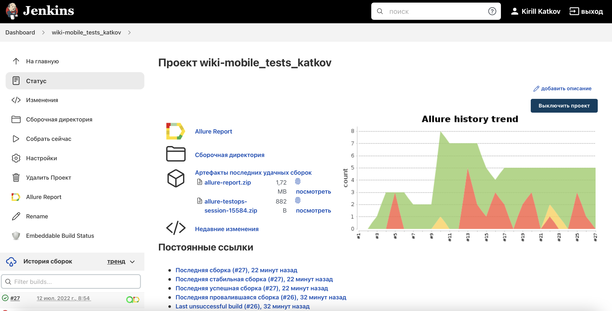
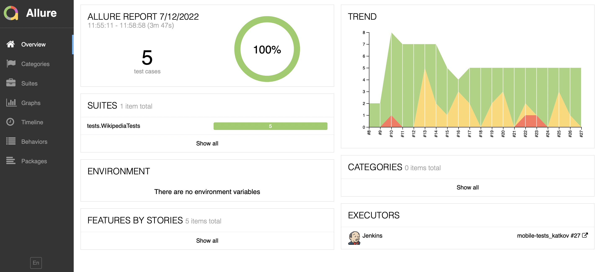
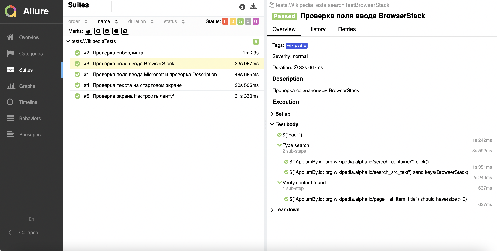
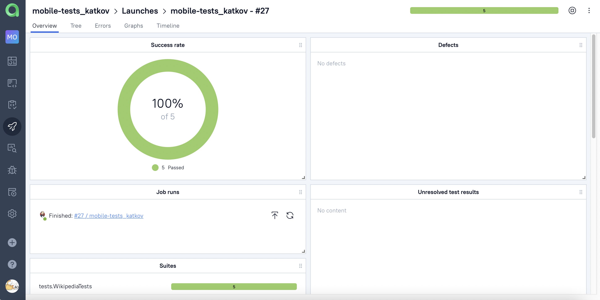
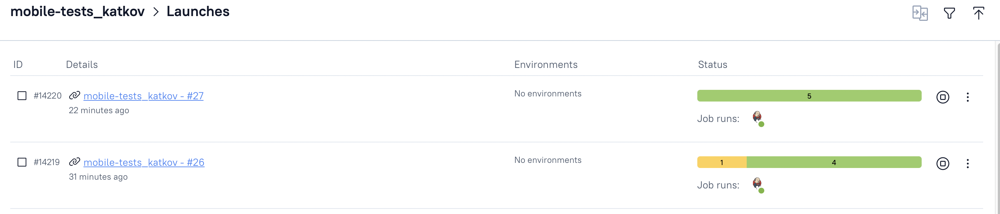

# Дипломный проект по автоматизации тестирования мобильного приложения Wikipedia. 


## :memo: Содержание:

- [Реализованные проверки](#boom-Реализованные-проверки)
- [Технологии](#classical_building-Технологии)
- [Сборка в Jenkins](#electron-Сборка-в-Jenkins)
- [Параметры запуска из jenkins](#electron-Параметры-запуска-из-jenkins)
- [Запуск из терминала](#electron-Запуск-тестов-из-терминала)
- [Allure отчет](#bar_chart-Allure-отчет)
- [Allure TestOps отчет](#bar_chart-Allure-TestOps)
- [Видео пример](#video_camera-Видео)

## :boom: Реализованные проверки

- ✓ Проверка текста на стартовом экране
- ✓ Проверка поля ввода BrowserStack
- ✓ Проверка поля ввода Microsoft и проверка Description
- ✓ Проверка экрана Настроить ленту
- ✓ Проверка онбординга


## :classical_building: Технологии

<p align="center">


</p>

## :electron: Сборка в Jenkins
</a>  <a target="_blank" href="https://jenkins.autotests.cloud/job/wiki-mobile_tests_katkov/">Jenkins job</a>
<p align="center">
<a href="https://jenkins.autotests.cloud/job/wiki-mobile_tests_katkov/"></a>
</p>

## :electron: Параметры запуска из jenkins

```
clean wikipedia "-DdeviceHost=browserstack"
```

## :electron: Запуск тестов из терминала

```
gradle clean wikipedia "-DdeviceHost=localhost"
```

## :bar_chart: Allure-отчет
</a> Отчет в <a target="_blank" href="https://jenkins.autotests.cloud/job/wiki-mobile_tests_katkov/27/allure/">Allure report</a>
<p align="center">
<a href="https://jenkins.autotests.cloud/job/wiki-mobile_tests_katkov/27/allure/"></a>
</p>
<p align="center">
<a href="https://jenkins.autotests.cloud/job/wiki-mobile_tests_katkov/27/allure/"></a>
</p>


## :bar_chart: Allure TestOps
</a> Отчет в <a target="_blank" href="https://allure.autotests.cloud/project/1452/dashboards">Allure TestOps report</a>
<p align="center">
<a href="https://allure.autotests.cloud/project/1452/dashboards"></a>
</p>
<p align="center">
<a href="https://allure.autotests.cloud/project/1452/launches"></a>
</p>

## :video_camera: Видео
<p align="center">
</a>
</p>
